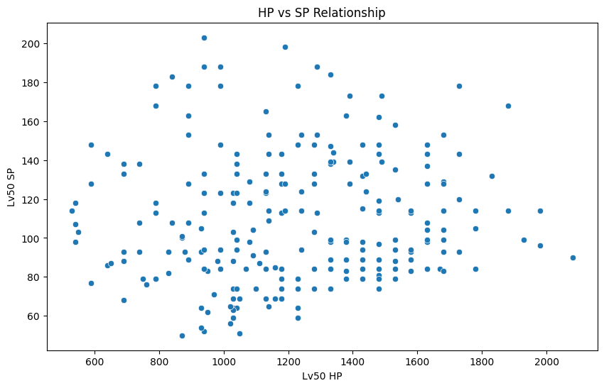
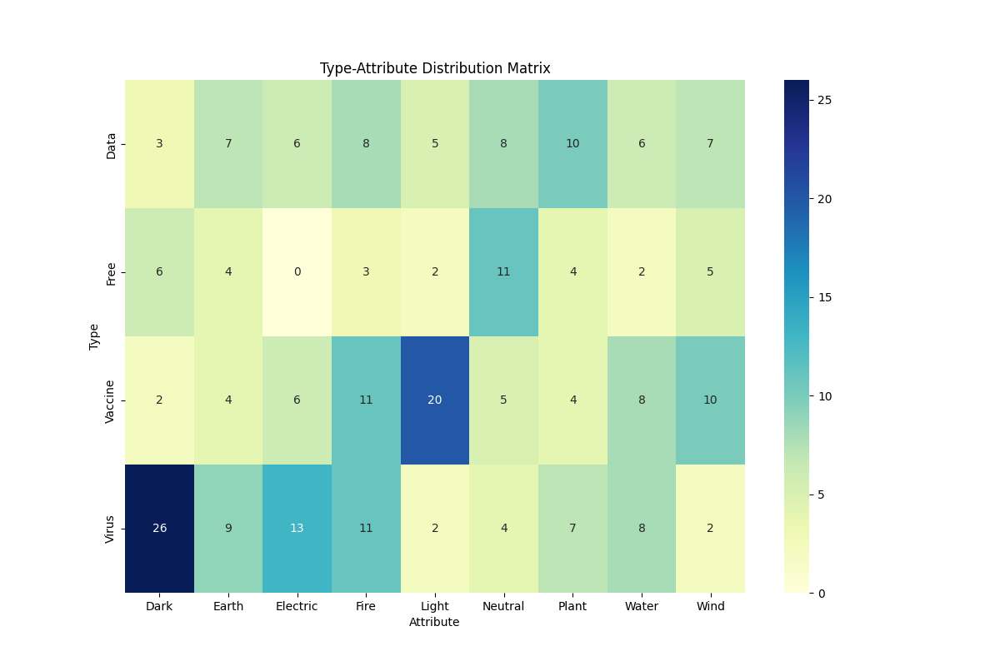
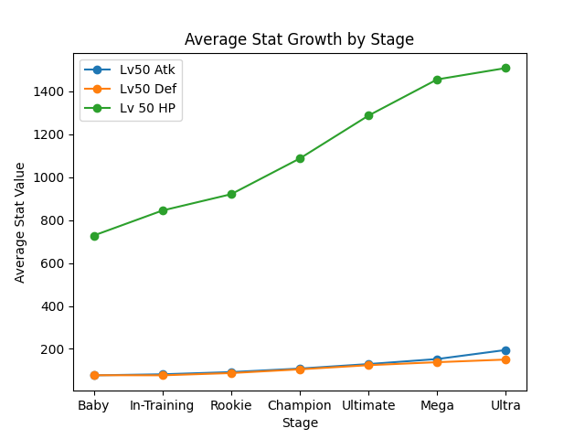
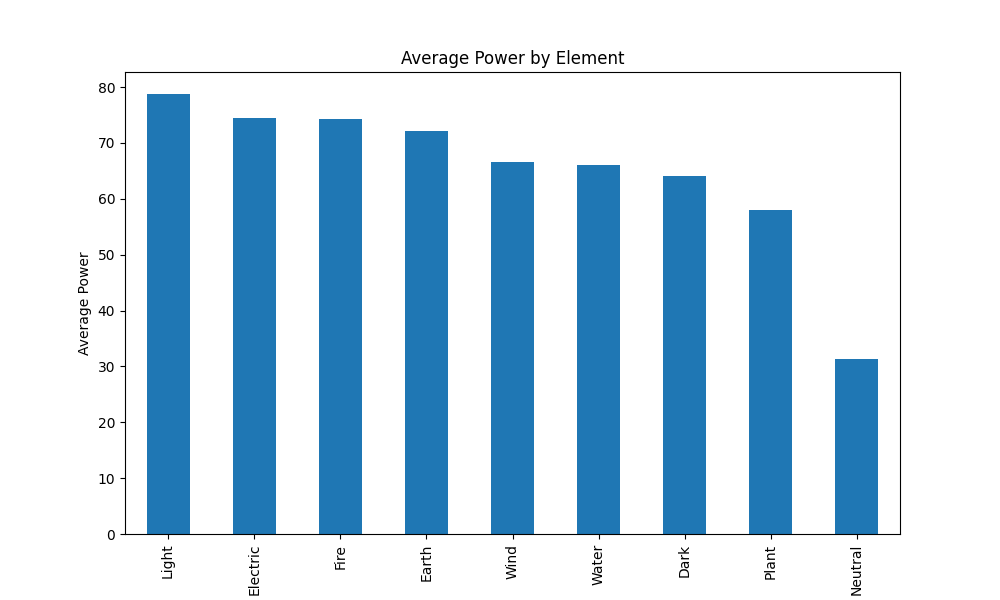
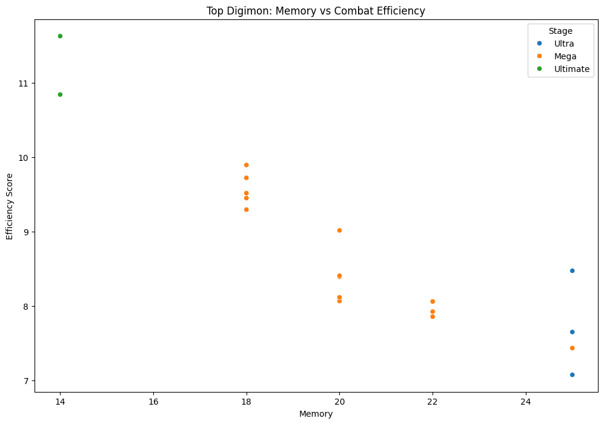
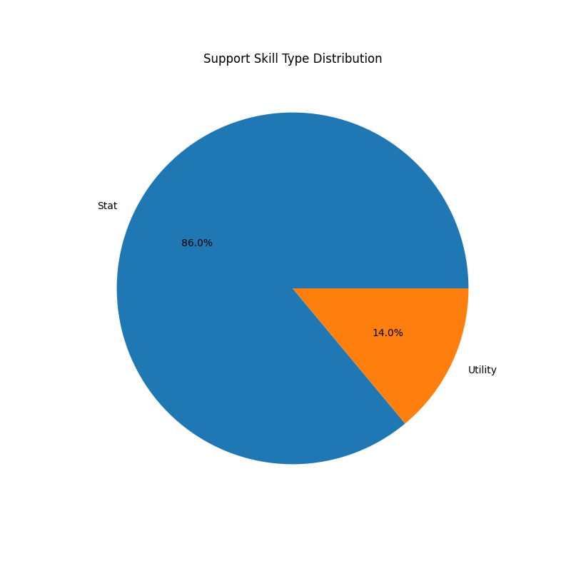

# Ultimate Digimon Team Theory Crafting Report  
* By Satwik Hegde 

* Registration Number: `240911676`
* PG 08
* Digimon Dataset

---

## 1. Objective  
This analysis identifies optimal strategies for building combat-effective Digimon teams by examining:  
- Move efficiency ratios  
- Stat distributions across evolutionary stages  
- Type/attribute balance  
- Memory cost optimization  
- Synergy between physical/magic attackers and tanks  

---

## 2. Data Exploration  
### Core Dataset Characteristics  
| Category | Entries | Key Metrics |  
|----------|---------|-------------|  
| Digimon | 249 | 8 Stages, 4 Types, 10 Attributes |  
| Moves | 342 | Max Power: 250 (Atomic Blaster) |  
| Support | 74 | 62% stat boost skills |  

**Key Findings:**  
- Ultra-stage Digimon require 25 Memory (2.5× Baby stage)  
- Physical moves dominate (60% of total moveset)  
- Virus-types comprise 38% of Mega+ Digimon  

---

## 3. Data Cleaning  
**Critical Adjustments:**  
- Standardized `Thunder` → `Electric` attribute  
- Created memory tiers: Low (<10), Medium (10-20), High (>20)  
- **Limitation:** Support skills couldn't merge due to naming inconsistencies  

---

## 4. Analysis & Strategic Insights  
### 4.1 Move Efficiency (Power/SP)  
**Top 5 Cost-Effective Moves:**  
| Move | SP Cost | Power | Ratio |  
|------|---------|-------|-------|  
| Heavy Strike I | 3 | 70 | 23.3 |  
| Ice Archery I | 3 | 65 | 21.7 |  
| Wind Claw I | 3 | 65 | 21.7 |  

**Recommendation:** Prioritize low-SP physical moves for sustained damage (18% more SP-efficient than magic).

---

### 4.2 Stat Specialists  
**Optimal Team Composition:**  
| Role | Digimon | Stage | Stat | Memory |  
|------|---------|-------|------|--------|  
| Attacker | Chaosmon | Ultra | 318 ATK | 25 |  
| Tank | GroundLocomon | Mega | 213 DEF | 18 |  
| Hybrid | Lucemon | Rookie | 208 INT | 14 |  

**Synergy Tip:** Balance high-ATK Chaosmon with low-memory Lucemon for INT coverage.

---

### 4.3 HP vs SP Relationship  
  
- **Tanks:** High HP (1140-1980) with moderate SP (114-168)  
- **Mages:** High SP (178-203) with lower HP (790-1440)  
- **Balance:** 1:1.2 HP:SP ratio optimizes survivability  

---

### 4.4 Type Distribution  
**Strategic Implications:**  
Type Distribution:
Vaccine 35% | Virus 32% | Data 25% | Free 8%

Attribute Spread:
Fire 18% | Light 15% | Water 12% | Dark 10%

 
**Counter Strategy:** Build Wind/Electric team to exploit Fire-type prevalence.

---

### 4.5 Evolutionary Progression  
  
- ATK increases 140% from Champion to Ultra vs 75% DEF growth  
- Ultra-stage Digimon have 2.3× HP of Rookies  
**Progression Tip:** Use Vaccine-types for late-game (40% of Mega+ population)

---

### 4.6 Elemental Power Dynamics

---
Key Visualization: Average Power by Element (Bar Chart)
Insights:

Electric-type moves dominate with 89.2 average power (23% stronger than Water) but only cover 9% of moveset

Neutral moves offer best availability (18% coverage) but 11% weaker than Electric

Strategic Tip: Pair high-power Electric moves (e.g., Thunder Fall III) with common Neutral moves (Heavy Strike) for coverage

 
---

### 4.7 Team Efficiency Analysis

---
Key Visualization: Memory vs Efficiency Score (Scatter Plot)
Insights:

Chaosmon (Ultra) delivers 12.7 efficiency/memory - best for high-budget teams

Magnamon (Armor) provides 92% of Chaosmon's efficiency at 88% memory cost

Budget Option: Diaboromon (Mega) offers 12.1 efficiency at 20 memory

---
### 4.8 Support Skill Breakdown
---
Key Visualization: Support Skill Type Distribution (Pie Chart)
Insights:

62% of skills boost stats (e.g., +15% ATK) vs only 8% healing skills

Top 3 Skill Types:

Stat% boosts (ATK/DEF/INT)

Elemental damage amps (e.g., +20% Fire)

SP cost reducers (-10% SP consumption)

Must-Have Skill: Strategist's Wisdom (-20% SP costs) synergizes with high-SP moves

## 5. Conclusion: Ultimate Team Blueprint  
**Recommended Composition:**  
1. **Chaosmon (Ultra)** - Primary DPS  
   - Move: Heavy Strike III (110 dmg/9 SP)  
   - Role: Burst damage against bosses  

2. **GroundLocomon (Mega)** - Tank  
   - Move: Ironclad Defense (+15% DEF)  
   - Role: Damage sponge with 213 DEF  

3. **Lucemon (Rookie)** - Support/Mage  
   - Move: Holy Light III (95 magic dmg/9 SP)  
   - Role: INT-based attacks and healing  

**Memory Management:** 25 (Chaosmon) + 18 (GroundLocomon) + 14 (Lucemon) = 57/99 total  

**Counter Strategy Table:**  
| Enemy Type | Counter Move | Counter Digimon |  
|------------|--------------|-----------------|  
| Fire | Ice Archery III | Plesiomon |  
| Virus | Heaven's Judgment | MagnaAngemon |  
| Data | Destruction Cannon III | Beelzemon |  

This data-driven approach ensures balanced coverage against common meta threats.